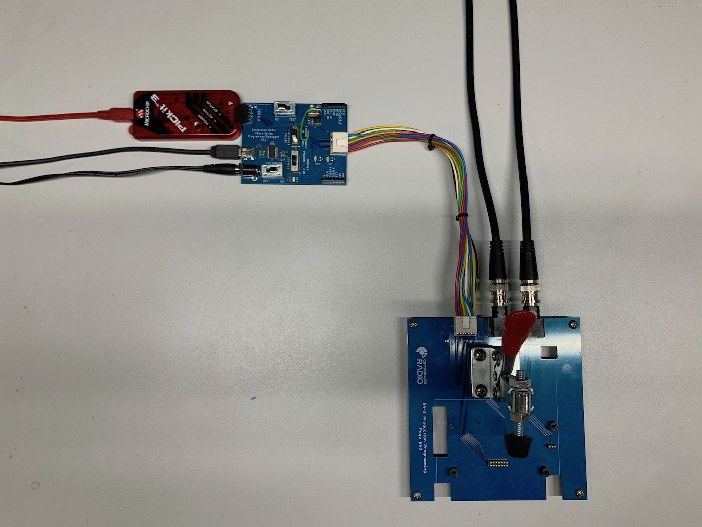

# Programming

This is a step-by-step to take the MDeck BA-2 board from assembled board to functioning unit by programming the various systems and running validations. The process involves producing and assembling a few Cantaloupe Radio hardware fixtures, then performing a per-unit programming procedure using those.

## Hardware

The image below shows the main hardware components involved in the programming procedure:

There are 3 custom PCBs to produce, 2 to assemble and one custom cable:

* MDeck BA-2 Production Programming Pogo Bed - This is the programming bed where BA-2 boards to be programmed are dropped in and clamped down using the toggle clamp. With the toggle clamp engaged, contact is made between the bottom of the BA-2 board and the 7x2 pogo programming connector underneath. All programming IO flows through this connector. An additional 3-pin pogo connector is used to probe analog audio output. There are 3 connectors along the back of the board. From left to right:
    * 7x2 programming connector - Connection point for progamming IO, as present at the pogo pins
    * BNC left channel output - Probe of the analog output path (as fed to CM5908) leaving the board. Used for validation
    * BNC right channel output - Same as above for right channel
* Toggle clamp standoff board - this board is purely a mechanical spacer. In order to get the toggle clamp to the right operating height, it needs to sit above the pogo board a bit. Doing it with PCBs is just one way. At standard PCB thickness, you'll need 5 boards.
* MDeck Programmer / Debugger v0.2 - This board handles some connector interfacing, signal muxing & translation, and probing functions to enable both production programming and debugging of an MDeck device under test (DUT). Its functions include:
    * Powering the DUT via a 12V barrel jack input
    * Providing a micro-USB UART connection that functions in 1 of 2 ways:
        * Programming of the Bluetooth module firmware and configuration
        * Monitoring debug logging output from the DUT microcontroller
    * Providing a connection point for the Microchip programmer needed to program the microcontroller
    * Allows probing of any of the programming IO lines via 2 female headers
    * Switches to configure power, comms, and programming mode
* Wire harness - this harness acts as an interconnect between the programmer board and the pogo bed. It will require an appropriate crimping tool to assemble, but is otherwise straightforward.

### Required Hardware

* Programmer, pogo bed, and standoff PCBs - gerber and source files for these are available here, ready to send to your fab house of choice
* Components for the programmer, pogo bed, and wire harness - the BOM for each of these, including DigiKey P/Ns are available here, ready to plug in and order
* 2 BNC cables to connect to an oscilloscope for testing
* Microchip PICKit3 programmer - this kit is needed to program the microcontroller on the board from a desktop with the all-important Cantaloupe Radio firmware
* 12VDC 2x5.5mm barrel jack power supply for programmer board
* MicroUSB cable for BT module programming or debugging

### Assembly

Once you've procurred all the required hardware, assembly is non-trivial but straightforward using the BOMs and part IDs printed on the boards. The trickiest assembly steps will probably be the 2 fine-pitched SMD ICs on the programmer board, but with some flux it should be fine.

As mentioned, a proper crimping tool should be used for robust cable connections. [These](https://www.waytekwire.com/item/539/Molex-Hand-Tool-MLX/?gclid=EAIaIQobChMI2v601KKr6gIVAuDICh1eggkiEAQYAiABEgJWkfD_BwE) seem to work pretty well.

## Software

Programming the software on the board breaks down into 3 parts:
* Bluetooth module firmware - As of this writing, the BM64 Bluetooth module used on the board still ships with v1.1 firmware, although the v2.1 firmware has been out for some time. To get many needed Bluetooth features and bug fixes, we must update the core Bluetooth operating code of the module
* Bluetooth module configuration - In order to customize the module's behavior for our purposes, there is a blob of configuration settings we must separately write to the Bluetooth module's EEPROM.
* PIC microcontroller firmware - This is the custom Cantaloupe Radio code on the microcontroller that runs the show, interfacing with the original radio microcontroller, the Bluetooth module, and the audio codec to perform the top-level integration

### Requirements

You'll need the following software:

* A Windows computer (VM is fine)
* Bluetooth module programming tools - [Microchip BM64 Software & Tools (DSPKv2.1)](http://ww1.microchip.com/downloads/en/DeviceDoc/BM64%20Software%20&%20Tools%20(DSPKv2.1).zip)
* Microchip MPLAB X IDE/IPE toolset for programming PIC

TODO ^^ more details on above and software programming steps to follow